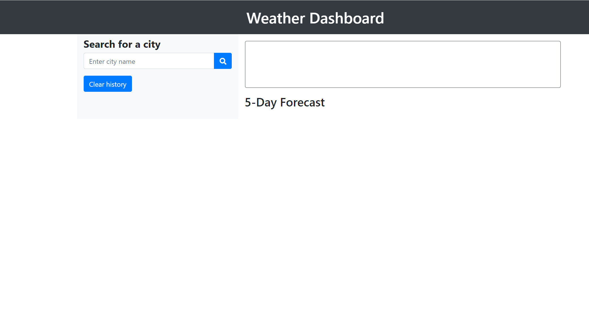
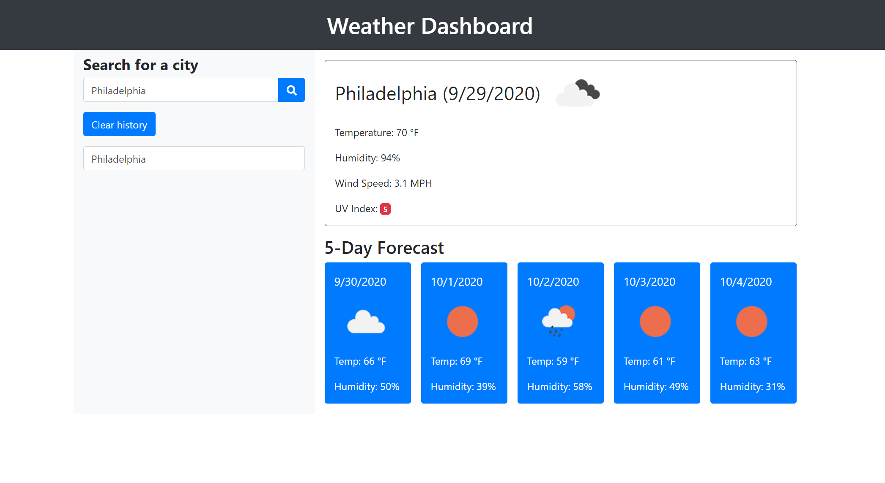
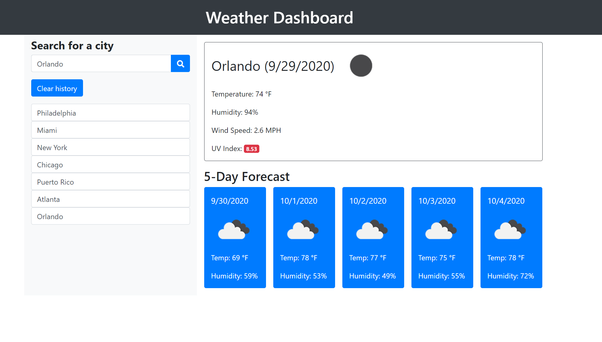

# Weather Dashboard

Weather Dashboard is the sixth homework assignment for Penn LPS Coding Bootcamp. This application built with html, Javascript, jQuery, and using APIs. 
In this weather dashboard users can search for any city to check current weather along with other weather information. The searched cities can be saved and listed under search bar. 

